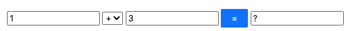
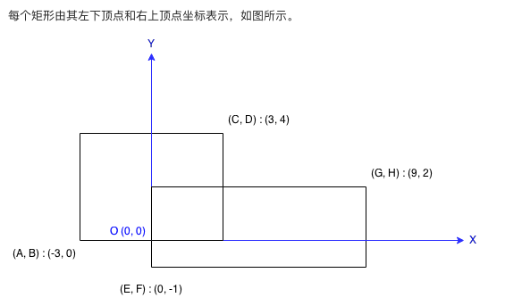

# 前端基础笔试题(选答)
要求：
1. 时间有限，所有的题都是选答题。请选择最能反映你的经验、能力的问题作答。
2. 请把答案写到牛客网的代码区、或注释中。本题集题号，与牛客网题号不需要一一对应
3. 所有题使用js/ts 语言作答，也可用伪代码。尽量写出实际可执行的代码。

## dom/css 操作: 消息居中
1.请给下面的html代码加上css，让消息提示框居中显示：

    

        <h3>屏幕居中消息</h3>
    

要求：
1. 消息框要屏幕居中(无论鼠标如何滚动，都居中显示)
2. 文字也要居中
3. 请备注一下你所用到的css 属性的含义

## React、vue或原生js 写一个计算器
写一个简单的 四则运算计算器：
1. 输入: 两个数字(包括负数、浮点数)，一个运算符
2. 点击`=`等号，输出计算结果
3. 要求代码可执行并输出正确的结果

样例：

模板：

        <input  value={1} onChange={cal}/>
        <select>
            <option value="+">+</option>
            <option value="-">-</option>
            <option value="*">*</option>
            <option value="/">/</option>
        </select>
        <input value={3} onChange={cal}/>
        <button onClick={cal}>=</button>
        <input value="?" />

## 实现一个js函数
能用js 实现这样一个js 函数吗

    sum(1)(2)() //3
    sum(1)(2)(3)() //6
    sum(1,2,3)() //6

## Promise 
用js写一个sleep 延时函数

    function sleep(seconds){
        //请补全
    }

    (async function(){
        console.log('begin....');
        await sleep(5);
        console.log('5 seconds eslaped.');
    })()

## 闭包是什么？
闭包是什么？请用代码举例说明

## 给Array 加一个uniq 方法
给Array 加一个uniq 去重方法, 请补全代码

    Array.prototype.uniq = function() {
        //请补全代码
    };
    console.log([1,2,3,3].uniq()) //output: [1,2,3]

能解释一下为什么是用Array.prototype.uniq 而不是 Array.uniq 吗？

## 两向量的平行
在平面中有两个向量，判断向量是否平行, 请补全以下代码

    vector1 = [1,2]
    vector2 = [-1,2]
    function isVectorParalell(vector1,vector2):boolean {

    }

## shell操作
有一个非常大的ip日志文件ip.log，格式为： ip,host,time

    $ cat ip.log
    192.168.1.1,momenta.ai,2020-07-06 T00:00:00
    192.168.1.2,baidu.com,2020-07-06 T00:00:01
    192.168.1.2,baidu.com,2020-07-06 T00:00:01

1. 请找到指定ip对应的域名?
2. 请找出访问次数最多的ip?

# 场景题(选答)

## 新冠状病毒
1000人中有1人带有病毒，我们需要对这1000人抽血，并用试剂盒 找出这名病毒携带者。
1. 我们可以将任意人次的血混合后检测（混合稀释不降低检测效果），血可稀释，可无限次使用，永不过期
2. 每盒试剂盒验血，要1天才出结果, 试剂盒不可重复使用

你可以在几天? 用几盒试剂盒? 找出这名病毒携带者？
如果有一个或多个方案，请都给出

## 最近的餐厅
假设小明和小红想在晚餐时选择一家离两人最近餐厅，并且他们都有一个表示最喜爱餐厅的列表，
1. 每个餐厅的名字用字符串表示。
1. 餐厅的索引，表示餐厅到自己家的距离

帮助他们找出他们共同喜爱的最近的餐厅。如果有多个答案请全部给出 

示例:

    输入:
    ["沙县小吃", "四川火锅", "广东堡仔饭", "KFC"]
    ["KFC", "沙县小吃", "山西面馆"]
    输出: ["沙县小吃"]
    解释: 两数组中的值相同 且`离大家最近`的是"沙县小吃"，它有最小的距离和1(0+1)。

请实现代码, 并给出算法复杂度

## 求矩形相交的面积
请用实现矩形相交面积的计算(此题不能用伪代码, 代码要可执行)：

    var rectA = {
        left:-3, 
        bottom:0, 
        right:3, 
        top:4
    }
    var rectB = {
        left:0, 
        bottom:-1, 
        right:9, 
        top:2
    }
    function getIntersectArea(rectA, rectB){
        // 返回相交面积 或异常
    }
    getIntersectArea(rectA,rectB) == 6 //true

扩展：如果是三维空间，两长方体的相交体积怎么计算（简答）？